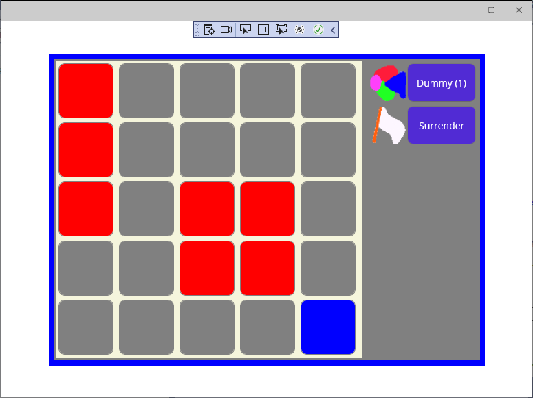
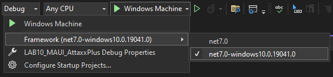

# AttaxxPlus Labor

Ezen a laboron az AttaxxPlus mintaalkalmazást kell továbbfejleszteni.

A feladatok során legalább minden részfeladat elkészítése után commitolj! A benne lévő commit message pedig utaljon arra, hogy melyik feladatot oldottad meg.

## Felkészülés a laborra

A labor során egy viszonylag összetett alkalmazásban kell mozogni és módosításokat végrehajtani. Ehhez fontos, hogy az alapvető felépítéssel és működéssel már tisztában légy! Ha még nem tetted meg, nézd meg a Moodle alatti videókat. A labor végére az eredménynek ehhez hasonlónak kell lennie:



Ha a kiinduló projektet nem tudod lefordítani, vagy nem indulna el, ellenőrizd, hogy a megfelelő Framework van kiválasztva:



## Értékelés

**Vigyázat!**: Automatikus kiértékelés kísérleti jelleggel!

A labor során a feladatokat egy automata ellenörző szoftver fogja ellenőrizni! Ez az ellenőrző szoftver egy GitHub Action-ben fog lefutni. (További információk: https://docs.github.com/en/actions). Ez azt jelenti, hogy a labor megoldás csak akkor értékelhető, ha az ellenőrző szoftver le tud futni. Ennek érdekében ne módosíts semmit a projekten amit külön nem kér a feladat! A Solution és a Projekt fájlt semmiképpen se módosítsd! A Github Action leírását a `.github/workflows/evaluate.yaml` fájlban találod. Ennek módosítása esetén a megoldásod érvénytelenné válik!

Az értékelő szoftvert mindenki maximum 3 alkalommal tudja használni, ezért figyelj arra, hogy csak akkor futtasd, ha úgy gondolod készen vagy. Az Action automatikusan elindul minden alkalommal, amikor pusholsz egy olyan branchre, amihez Pull Request tartozik, ezért a megoldás során nagyon körültekintően járj el az alábbiak szerint:

* Klónozd le a repositoryt a számítógépedre!
* Hozz létre egy új branchet `megoldas` néven!
* Töltsd ki a `neptun.txt` fájlt a Neptun kódoddal!
* Oldd meg a feladatokat, minden feladat megoldás utána commitolj!
* Figyelj rá, hogy ha véletlenül módosítottad a Solution vagy a Projekt fájlt, akkor azt ne stageld!
* Ha készen vagy, pushold fel a megoldásodat a GitHubra!
* Hozz létre egy Pull Requestet a `megoldas` branchről a `main` branchre. Ne felejtsd el hozzárendelni a laborvezetődet `Reviewer`-ként.

Ezek után le fog futni az ellenőrzés. Ennek eredményét a Pull Request-en vagy a repository `Actions` fülén tudod ellenőrizni.
Sikertelenség esetén az Action hibüzenetéből tudsz tájékozódni. Kérj segítséget a laborvezetődtől!

Ha az Action sikeresen lefutott, akkor a Pull Requestben egy új komment jelenik meg egy pontszámmal. Ha nem vagy elégedett az eredménnyel, módosíthatod a megoldásodat a következő módon:

* Készítsd el a módosításokat a számítógépeden! Minden módosítás után commitolj!
* Ha elkészültél, és szeretnéd ismét lefuttatni az ellenőrzést, pushold fel a megoldást!

Az ellenőrzés automatikusan lefut, és megkapod az új pontszámodat. Ezt összesen 3 alkalommal teheted meg. A laborodat akkor tudjuk értékelni, ha legalább egyszer sikeresen lefutott az ellenőrzés! Ha véletlenül több alkalommal pusholsz, a 3. alkalom után az ellenőrzés nem fog lefutni!

A laborok értékelése során az elsődleges szempont az automatikus értékelő álltal meghatározott pontszám, azonban a laborvezető ezt felülbírálhatja, ha a megoldásod nem megfelelő. Nem forduló alkalmazást nem tudunk értékelni.

## Manuális ellenőrzés

A megoldásodat manuálisan is ellenőrizheted pusholás előtt. Ehhez nyiss egy terminált a Visual Studio-ban a `View > Terminal` menüponttal. A terminálban fordítsd le a megoldásodat a következő parancs segítségével:

```bash
dotnet build -f net7.0
```

A kiértékelés automatiksan megtörténik a buildelés után, az eredményedet a Terminál ablakban találod.

## 1. feladat: a kijelölt mező keretszíne

(A labor elején, már most hozz létre egy új branchet és utána azon dolgozz, hogy a pull requestet könnyű legyen majd a labor végén létrehozni! És ha az egyetemen kezdted el a munkát, mielőtt elmész, ne felejtsd el felpusholni a változásokat a laborgépről a githubra!)

Bemelegítő feladatként modosítsuk a kijelölt mező keretének színét (valami ott jól kinéző színre)!
A mezők megjelenítését a View/GameView.xaml írja le. Itt minden mező egy nyomógomb, aminek a keretszínét (BorderColor) egy konverteren keresztül állítjuk be annak megfelelően, hogy ki van-e választva. Ennek a konverternek kellene más színt visszaadnia, ha ki van jelölve a mező...

## 2. feladat: a StaticResource kulcsok (debug gyakorlás)

Mi van, ha egy StaticResource kulcsát átírjuk? Például a GameView.xaml-ben a OwnerIndex2BrushConverter kulcsot valami más értékre. Hol és milyen hiba jön? Miért nem jött elő fordítási időben? Ezt próbáld ki, hogy ha majd ilyen hibával találkozol, könnyebben felismerd! Utána írd vissza a kulcsot és mehetsz is tovább.

## 3. feladat: mező kijelölés (debug gyakorlás)

Ebben a feladatban megint egy lehetséges hibaforrást kell megvizsgálni, ezzel gyakorolva a működés követését és a debuggolást.

A FieldCommand.Execute-ban a "vm.SelectedField = current;" helyett miért nem elég a "current.IsSelected=true;"? A megoldáshoz meg kell nézni az IsSelected propertyt, és hogy mi történik, amikor ennek értéket adunk. Lehet, hogy nem csak egy értékadás fut le, hanem valami más is...

## 4. feladat: átlós lépés

A kiadott játékban van egy hiba: az eredeti szabályok szerint a szomszéd mezőre lépéskor átlósan is lehet lépni, most azonban csak lapjával szomszédos mezőre lehetséges. A feladat a hiba kijavítása. 

A hiba kereséséhez annyit már tudunk, hogy amikor egy mezőre rákattintunk, a AttaxxPlus.ViewModel.FieldCommand osztály, mint ICommand aktivizálódik. Első körben ennek forráskódját érdemes tanulmányozni és a végrehajtást egy törésponttal megállítva végigkövetni, hogy mik történnek és minek mi a feltétele. Valahol itt kell lennie egy feltételnek, ami megmondja, hogy mi a szabályos lépés és mi nem.

## 5. feladat: boosterek listája

Egy további hiba, hogy üres a boosterek listája, pedig a DummyBoosternek szerepelnie kellene rajta.
Annyit tudunk, hogy a View/GameView.xaml user controlban szerepel a booster lista "BoosterPanel" néven. Ez adatkötéssel jeleníti meg a boosterek listáját. Valószínűleg az a hiba, hogy abba a bizonyos listába nem kerülnek bele a boosterek, amikor a program kigyűjti az elérhető boostereket.

## 6. feladat: DummyBooster nem tud elfogyni

A programban a DummyBooster hibásan működik! Ha a számláló szerint elfogynak a használati lehetőségek, akkor is használható marad (ami abban nyilvánul meg, hogy megnyomásakor a másik játékos következik). Javítsd ki a hibát!

A megoldáshoz debuggolni kell, hogy mi is történik, amikor lefut a DummyBooster. És főleg azt, hogy miután lefutott a DummyBooster.TryExecute, utána hol folytatódik a program és ott hogyan dől el, hogy a másik játékos következik-e utána. Kezdetnek tegyél egy breakpointot a TryExecute-ba...

## 7. feladat: DummyBooster játékosonkénti számlálóval

Jelenleg a DummyBooster számolja, hogy hányszor lehet aktivizálni, de egy kicsit fura, hogy a játékosoknak közös számlálója van és nem mindenkinek saját.
A DummyBooster.usableCounter csak egy értéket tud tárolni. Módosítsd a kódot, hogy a két játékosnak külön legyen egy-egy számlálója. (3 elemű tömb kell majd, mert a játék a játékosokat 1-től számozza.)

A TryExecute-ban ki kell majd derítened, hogy ki az aktuális játékos. Ebben az ősosztályból örökölt GameViewModel tud segíteni.

## 8. feladat: SurrenderBooster készítése

A játékban előfordul olyan szituáció, amikor egy játékos nem tud lépni, de még van szabad mező, így nem ér véget a játék.
A legegyszerűbb megoldás erre a "Surrender Booster", amit ha megnyom egy játékos, minden maradék mező az ellenfél színét veszi fel, ami miatt véget ér a játék. A mostani feladat ennek megvalósítása.

Kiindulási alapnak lehet használni a Dummy Boostert. Az alkalmazás már tartalmaz egy képet SurrenderBooster.png néven, ezt nem kell megrajzolni. Az elkészítéskor a SurrenderBoostert származtassa (a DummyBoosterhez hasonlóan) a BoosterBase osztályból, hogy annak GameViewModel propertyjén keresztül el tudja érni a GameBase osztály példányát, majd abban a Fields propertyt.

## További szorgalmi feladat lehetőségek

A maradék időben néhány fejlesztési lehetőség. Először egy könnyebb:

- Egy további booster elkészítése, ami az éppen kijelölt mezőre hat (de csak ha a saját játékosé). Abban a sorban és oszlopban minden mezőt üresre állít. Ez a booster minden játékosnak csak egyszer működjön!

És néhány összetettebb:

- 3 játékos verzió készítése. Az alkalmazás jelentős része akárhány játékost támogat. Azt, hogy hány van, a GameBase leszármazottai adják meg. Most a SimpleGame-et példányosítjuk induláskor (hogy hol, azt a Find References funkció mutatja meg). Hozz létre egy új GameBase leszármazottat, ami 3 játékost definiál. Ezen kívül a játékosok színeit megadó IValueConverterben is biztos fel kell venni egy új színt...
- Gépi játékost hol lehetne beilleszteni a rendszerbe? A GameBase.EndOfTurn() fut le akkor, amikor egy játékos végzett a körével. Itt ha van nem emberi játékos, akkor azokon végig lehet menni és le lehet őket futtatni egészen addig, amíg nem lesz vége a játéknak vagy egy emberi játékos nem következik.
- Új "game over ellenőrzés": a teljesen (dupla gyűrűvel) bekerített játékos nem tud tovább lépni. De a játék még nem veszi észre ilyenkor, hogy vége van... Ennek a feladatnak a célja, hogy ilyenkor is magától véget érjen a játék és ne kelljen a SurrenderBoostert használni.

